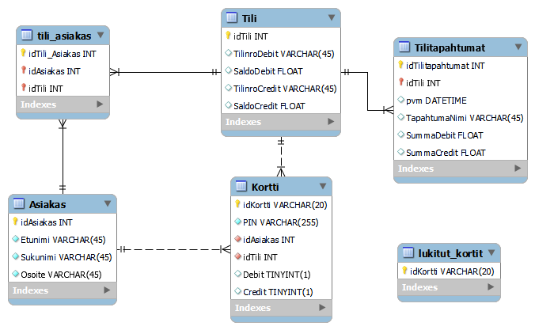

# ATM Simulator Project Spring 2023

This software development project involved creating an ATM simulator with a frontend built using Qt Creator and a backend powered by a [Uniform Server](https://www.uniformserver.com/). The backend services were made available through a REST API built with Express/Node.js. For simulating bank cards, RFID tags and readers were utilized to replicate card scanning functionality.

Features of the project include:

- **Frontend:** Developed with Qt Creator for a responsive user interface.
- **Backend:** MySQL database managing transactions and user data.
- **REST API:** Implemented using Express/Node.js to handle requests between the frontend and backend.
- **Bank Card Simulation:** RFID tags and readers were used to simulate bank card interactions for authentication.

## Database ER-diagram

## Sketch of the user interface

